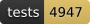

# &nbsp;Vaelii

<!-- badges:start: regenerated by scripts/update-badges.sh (do not hand-edit) -->
[](LICENSE)
[](https://github.com/vaelii/vaelii/releases)
[](test)
[](src/vaelii/impl/taxonomy.clj)
[](src)
[](src/vaelii/core.clj)
[](docs/dependencies.md)
[](https://github.com/sponsors/vaelii)
<!-- badges:end -->

A contextualized common-sense knowledge base: an in-memory or on-disk store of
**sentexes** (sentence + context), indexed by a **count-aware trie**,
with forward/backward inference and JTMS truth maintenance.

## Requirements

- JDK 21+, Leiningen 2.10+ — no external services
- macOS and Linux; Windows is not supported ([why](docs/storage.md#the-image-vaeliiindexsnapshot-off-by-default))

## Quick start

As a dependency — Leiningen `[com.vaelii/vaelii "0.5.0"]`, or deps.edn
`com.vaelii/vaelii {:mvn/version "0.5.0"}` — from [Clojars](https://clojars.org/com.vaelii/vaelii).
To work on it instead:

```sh
lein deps
lein test          # integration tests
lein repl          # loads namespace vaelii.core
```

Conventions: predicates are `camelCase`, individuals `CapitalCamelCase`, types
`snake_case` (unary predicates, e.g. `(dog Muffet)`), contexts end with `Context`.

```clojure
(require '[vaelii.core :as v] '[vaelii.starter :as starter])

(def kb (v/open-kb {}))                            ; in-memory records + index
                                                   ; {:backend :disk :dir "/path"} to persist

;; a read sees what its context sees, up the genlContext cone — so say that the
;; world context reads the general one, or the rules below are invisible from it
(v/assert kb '(genlContext NaturalWorldContext UniverseContext) 'UniverseContext)

;; a type hierarchy + a typed individual; genl is transitive and cached
(v/assert kb '(genl dog animal) 'UniverseContext)
(v/assert kb '(genl animal thing) 'UniverseContext)
(v/assert kb '(dog Muffet) 'NaturalWorldContext)
(v/isa?    kb 'Muffet 'animal)                       ;=> true (via genl; no context arg, so unscoped — any context counts)

;; a rule is a sentex; forward chaining + truth maintenance
(v/assert-rule kb '[(parentOf ?x ?y) (parentOf ?y ?z)] '(grandparentOf ?x ?z) 'UniverseContext)
(v/assert kb '(parentOf Tom Bob) 'NaturalWorldContext)
(v/assert kb '(parentOf Bob Ann) 'NaturalWorldContext)
(v/sentexes-matching   kb '(grandparentOf Tom Ann) 'NaturalWorldContext)  ;=> derived, placed in NaturalWorldContext

(let [bob (:id (first (v/sentexes-matching kb '(parentOf Tom Bob) 'NaturalWorldContext)))]
  (v/retract! kb bob))                             ;=> tears down what it solely supported

;; or skip all of the above: the bundled starter ontology, on its own stores —
;; the space number names the store, so a second KB wants one of its own
(def starter-kb (starter/load-into (v/open-kb {:space 2})))
```

## The model

The unit of knowledge is a **sentex**: a sentence — a Clojure s-expression, ground or a
pattern with `?x` variables — plus the one **context** it holds in.

A sentex canonicalizes into one of two records, split so a fact does not carry the
rule-only slots: an `AtomicSentex` holds `[sentence context id truth strength]`, and a
`RuleSentex` adds `[antecedent consequent varmap direction defeasible assumption
constraint]`. **A rule is a sentex too**, indexed additionally by its antecedent and
consequent predicates, so it gets a handle, truth maintenance and retraction for free.

A **handle** is the integer id a stored sentex or justification is referenced by,
allocated in assertion order. A **justification** is antecedent handles plus an informant,
pointing at a conclusion and carrying the strength it confers; the JTMS reads these to
compute belief. Sentences identical up to variable names, antecedent order, symmetric
argument order or comparison direction dedup to one handle.

Transitivity is not done with rules. The `genl` closure over types and the `genlContext`
closure over contexts are cached and recomputed when an edge changes, as is the equality
partition behind `rewriteOf` / `sameAs` / `equals`.

Four properties hold everywhere:

- **Order independence** — the same knowledge in any order yields the same beliefs. Belief
  is computed from current state rather than accumulated, and every tie-break keys on
  content, never on a handle.
- **Locality** — no operation recomputes the whole graph; a relabel is scoped to the
  affected region with the rest held fixed.
- **Context scoping** — a read sees what its context sees, up the `genlContext` cone:
  facts, rules, taxonomy edges and definitional checks alike.
- **Belief filtering** — a stored sentex is not a believed one. Matching, the taxonomy
  closures and the cached relations all follow belief.

Assert known-true content with `{:strength :monotonic}`. The default is `:default`, which
is most of a common-sense KB, and a default is defeasible at the edges.

## Web browser

```sh
lein run -m vaelii.web    # serves a starter-loaded KB on http://localhost:3000
```

Browse the upper ontology, any term (every sentex containing it), a sentex (its
supporting justifications and dependents), or a justification (its arguments and
conclusion) — all cross-linked.

## Loading a bigger KB

The browser loads more than the starter: the core vocabulary alone, a generated corpus of
a chosen shape, a vaelii export dump, an on-disk store, or a translated OpenCyc KB. Drop
one under `~/.vaelii/kbs/` and it appears on the `/kbs` page with no restart, loading in
the background and browsable before it finishes.

OpenCyc needs the reader plugin, which ships separately as
[vaelii-foreign](https://github.com/vaelii/vaelii-foreign). The whole route — from one
dependency to a 1.2M-sentex KB, and the small vendored fixture to try it on first — is
[docs/kbs.md](docs/kbs.md).

## CLI & daemon

Drive a KB from the shell, or serve it over the network — both drive `vaelii.core`
and add nothing to it. See [docs/operations.md](docs/operations.md).

```sh
# command line (--dir persists via the disk backend, recovered on open)
lein cli assert '(dog Muffet)' NaturalWorldContext --dir /var/lib/vaelii
lein cli match  '(dog ?x)'   NaturalWorldContext --dir /var/lib/vaelii   # => [(dog Muffet)]
lein cli repl --starter                                                   # interactive

# headless daemon: one process owns one KB, serves it as EDN over HTTP
lein serve 4200 /var/lib/vaelii
```

```clojure
;; a thin client (zero-dependency java.net.http), conn threaded explicitly
(require '[vaelii.client :as c])
(def conn (c/client "localhost" 4200))
(c/assert  conn '(dog Muffet) 'NaturalWorldContext)
(c/query   conn '(dog ?x)   'NaturalWorldContext)
```

## Documentation

[docs/](docs/README.md) carries one note per subsystem. Four to start with:
[kbs.md](docs/kbs.md) to get a KB in front of you, [api.md](docs/api.md) for the calls,
[naming.md](docs/naming.md) for the spellings the KB enforces, and
[contexts.md](docs/contexts.md) for what a read can see.
[glossary.md](docs/glossary.md) defines the vocabulary. When something does not do what
you meant — an empty query, a rule that will not fire, a KB holding facts nobody asserted
— [troubleshooting.md](docs/troubleshooting.md) is indexed by symptom.

## Contributing

[CONTRIBUTING.md](CONTRIBUTING.md) — the build, the conventions, and the contributor
terms. Commits are signed off under the [DCO](DCO), and a first pull request prompts
for the [CLA](legal/ICLA.md). Security reports go through
[.github/SECURITY.md](.github/SECURITY.md) rather than the issue tracker.

## License

Server Side Public License, version 1 ([LICENSE](LICENSE)).

Copyright © 2026 Vaelii LLC and the Vaelii contributors.

The SSPL is source-available rather than OSI-approved. The project intends to move to
an OSI-approved license; the contributor license agreement is what makes that possible
without re-collecting permission from every contributor.

Cyc and Cycorp are registered trademarks of Cycorp, Inc. Vaelii is not affiliated with,
endorsed by, or derived from Cycorp — it reads the published OpenCyc distribution
through a separate plugin, and ships none of it.
